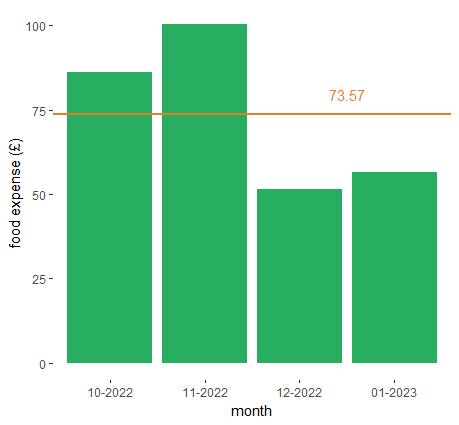

# personal-budget-analysis

## Skills demonstrated 

- cleaning the bank data to prepare for the analysis
- searching for insights and dependencies in data
- plotting with **ggplot2**
- commenting code so that it can be understood by others

## The data

I downloaded my transaction data from two banks which I used from Oct 2022 to Feb 2023. After cleaning it was of the following structure:

| date       | description | paidout |
|------------|-------------|---------|
| 07-02-2023 | boots       | 16.41   |

It contains only 4 full months as it is the exact amount of time I have spent in the UK by the current moment. During this time I had 153 transactions.

## Search for dependencies

I had a hypothesis that my nicotine expense correlates with my home food expense as both of this purchases types are connected with addictive behaviour (( home food means mostly crisps for me )). But it was not confirmed. I got an adjusted R-squared of 0.7755 with a p-value of 0.07788 > 0.05. 

## Plotting 

These plots primarily serve the purpose of mastering my ggplot2 skills.

## Notes
**R** version 4.2.2
**ggplot2** version 3.3.6
